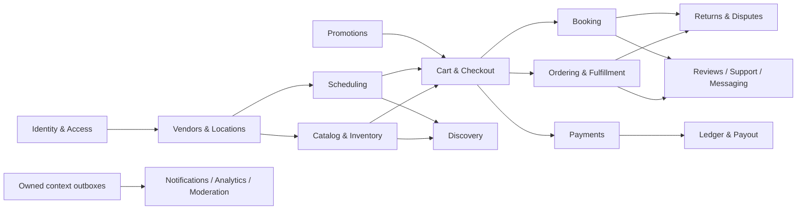

# Backend Context and Data Architecture

> **Document status:** specified
> **System claim:** **Specified — Not Executed — Not Verified**
> **Decision coverage:** [`DEC-079`–`DEC-087`, `DEC-120`, `DEC-125`, `DEC-129`, `DEC-140`](../governance/DECISION-REGISTER.md)
> **Normative owner:** backend topology and cross-context dependency rules

## Topology

The backend is one NestJS modular monolith plus one separate worker [DEC-081]. It is deployed as two processes but organized around explicit bounded contexts, not technical-layer folders. One PostgreSQL database and migration history are shared physically while tables and writes have one logical owner [DEC-085].

Ordering and Booking remain separate contexts. Checkout/Purchase coordinates their common Customer transaction; Payments/Ledger records their common money effects [DEC-082]. No “commerce” aggregate is allowed to absorb all three and erase their different lifecycles.

## Context map

| Context                        | Owns                                                                                     | May depend on                             |
| ------------------------------ | ---------------------------------------------------------------------------------------- | ----------------------------------------- |
| Identity & Access              | User, credentials/session references, MFA/recent-auth state, role grants                 | Better Auth adapter, audit                |
| Vendors & Locations            | Vendor lifecycle, membership, Staff identity link, Location, delivery-zone configuration | Identity                                  |
| Catalog & Inventory            | Listings, variants, Service definitions, media links, stock movements/reservations       | Vendor/Location                           |
| Scheduling                     | Staff qualification, calendars, availability rules, slot reservations                    | Vendor/Location, Service definitions      |
| Cart & Checkout                | Cart snapshot, quote, fulfillment choice, all-or-nothing hold, orchestration             | Catalog/Inventory, Scheduling, Promotions |
| Ordering & Fulfillment         | Vendor Order lines, pickup/delivery lifecycle, handoff evidence                          | Purchase commitment                       |
| Booking                        | Confirmed appointment, amendment, reassignment, meeting, attendance/no-show              | Purchase commitment, Scheduling           |
| Payments                       | Payment/refund/provider operation and reconciliation state                               | Checkout/Purchase                         |
| Ledger & Payout                | Accounts, immutable postings, earnings, freezes, transfers, payouts                      | Verified business/payment facts           |
| Promotions                     | Coupons, campaigns, funding/budget reservations and snapshots                            | Vendor, Checkout                          |
| Returns & Disputes             | Product returns, Booking disputes, evidence, decisions, appeals                          | Orders/Bookings, Ledger commands          |
| Engagement & Support           | Reviews, scoped conversations, Support Cases                                             | Completed offerings and cases             |
| Discovery/Analytics/Moderation | Rebuildable search and analytic projections, review queues                               | Published domain events                   |
| Notifications/Media/Demo       | Delivery records, media lifecycle, demo workspace lifecycle                              | Events and owning-resource checks         |

## Cross-context contract

- A context exposes commands, queries, and events; no other context writes its tables.
- Same-process calls do not waive interface or ownership boundaries.
- Immediate invariant checks use owning application services inside one orchestrated transaction where required.
- Eventual effects are recorded in the same commit through an outbox and completed by idempotent jobs.
- Cross-context projections are read models and cannot be used to bypass an authoritative check.
- Policy, price, address, offering, commission, promotion, and fulfillment terms required for later reproducibility are snapshotted at commitment.

## Atomic checkout exception

The 15-minute hold must reserve every selected SKU quantity and every selected Staff slot or reserve none [DEC-125]. Checkout coordinates the transaction, but Inventory and Scheduling retain responsibility for their reservation rows and invariants. Lock acquisition follows deterministic ordering. A timeout, deadlock victim, or failed component releases/rolls back the whole transaction. Provider payment starts only after the durable hold exists.

## Access isolation

Every tenant-owned repository requires the typed server-derived AccessContext, workspace, Vendor, and Location scope appropriate to the operation [DEC-129]. Unscoped Prisma access outside persistence adapters is prohibited. Pervasive RLS is intentionally not the primary design; future adversarial tests must therefore prove application-level isolation.

## Related documents

- [Data ownership and context boundaries](../data/DATA-OWNERSHIP-AND-CONTEXT-BOUNDARIES.md)
- [Canonical data model](../data/CANONICAL-DATA-MODEL.md)
- [Background jobs, outbox, and reconciliation](BACKGROUND-JOBS-OUTBOX-AND-RECONCILIATION.md)
