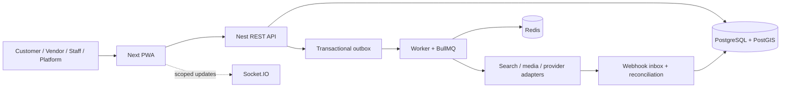

# Target System Description

**Status:** Specified — Not Executed — Not Verified  
**Normative owner:** intended overall technical system  
**Decision coverage:** `DEC-079`–`DEC-088`, `DEC-117`–`DEC-125`, `DEC-129`, `DEC-140`, `DEC-153`, `DEC-157`–`DEC-160`

Project Junction’s target is an Nx modular monolith: one Next.js adaptive PWA, one authoritative NestJS API, one background worker, and shared TypeScript contracts; PostgreSQL/PostGIS is transactional truth. It supports multi-Vendor goods and Staff-only fixed-duration appointments under one Checkout/Purchase, with separate Order/Booking lifecycles and provider-neutral financial/meeting/notification/media boundaries.

The target is a portfolio demonstration, not a deployed service. Provider accounts, secrets, infrastructure, code, containers, migrations, or dependencies are not present. Search/realtime/analytics are projections; WebSocket/provider payloads never replace database truth. All public target behavior remains gated by Phase 06 and future evidence.
