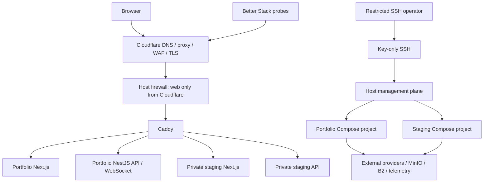

# Infrastructure and Network Topology

> **Document status:** specified
> **System claim:** **Specified — Not Executed — Not Verified**
> **Decision coverage:** [`DEC-089`–`DEC-097`, `DEC-110`–`DEC-111`, `DEC-136`–`DEC-137`, `DEC-179`](../governance/DECISION-REGISTER.md)
> **Normative owner:** target host, network, and environment topology

## Host model

Project Junction targets one owned, hardened VPS with Docker Compose and Caddy [DEC-089–DEC-090]. Host downtime is accepted for this portfolio system; the 99.5% objective is not an SLA [DEC-137]. Initial sizing is approximately 4 vCPU, 8–16 GB RAM, and 160+ GB SSD/NVMe, finalized through load tests [DEC-091].

Ubuntu 26.04 LTS and versioned Ansible provisioning are **DERIVED-PLAN-DEFAULTS**, not User-confirmed host implementation. They require acceptance and current lifecycle verification before provisioning.

## Network path

Cloudflare proxies public traffic. Full Strict TLS, Caddy, a locked origin, and Cloudflare-only web firewall paths are selected [DEC-097]. Application rate limits, CSRF, authorization, and abuse controls remain mandatory; the edge is not the application security boundary.

Private staging routes are protected by the selected private-access layer and are not reachable as a public preview/discovery experience. Public host exposure is limited to Caddy’s web ingress; PostgreSQL, Redis, Meilisearch, worker diagnostics, object-service administration, Docker, and Platform administration never receive public host-port mappings.

## Compose isolation

Portfolio production and staging have separate project names, networks, volumes, databases, Redis, Meilisearch indexes, object buckets/namespaces, secrets, cookie domains/names, provider endpoints, telemetry projects, and resource limits [DEC-093]. Only Caddy joins the minimum networks needed to route traffic. Databases, Redis, Meilisearch, worker diagnostics, Docker API, and admin ports are not Internet-exposed.

## Intended service inventory

- Caddy reverse proxy.
- Portfolio and staging web/API/worker containers.
- Separate PostgreSQL 18/PostGIS, Redis, and Meilisearch services per environment.
- Media-processing tools isolated in worker execution.
- pgBackRest/WAL archiving and encrypted media-copy jobs.
- Host metrics/log shipping and heartbeat checks, with sensitive-data scrubbing.

MinIO runs in the isolated Compose project for app media and exposes only an HTTPS S3 endpoint through Caddy. A separate B2 account/bucket with encryption and Object Lock receives backups [DEC-094].

## Management and recovery

SSH is key-only and restricted by network/source policy; provider console access is the break-glass route. Deployment uses a narrow operator account and rootless/minimal privileges where compatible. Docker socket exposure to application containers is prohibited. Security updates, reboot policy, disk pressure, certificate/origin health, backups, and time synchronization require monitoring.

## Target management interfaces

**Procedure status: Specified — Not Executed — Not Verified.**

The future host interface has four deliberately separate paths:

| Path              | Intended operator                       | Permitted action                                                      | Prohibited shortcut                                      |
| ----------------- | --------------------------------------- | --------------------------------------------------------------------- | -------------------------------------------------------- |
| Edge/DNS          | designated delivery operator            | proxy, TLS/origin policy, abuse configuration                         | exposing origin directly to debug                        |
| Restricted SSH    | named host operator                     | inspect host health and invoke approved deployment/recovery procedure | sharing a general root login or app-container shell      |
| Release promotion | CI plus approved deploy operator        | use attested image digest and release manifest                        | pull `latest`, deploy a branch, or rebuild on production |
| Recovery          | separately authorized recovery operator | restore to isolated target and reconcile                              | overwrite a damaged writer without fencing/evidence      |

Future Compose project names, host paths, firewall implementation, and operator identities must be documented with the initialized infrastructure. Their absence here is intentional; this document does not create a host or authorize access.

## Related documents

- [Portfolio production deployment](PORTFOLIO-PRODUCTION-DEPLOYMENT.md)
- [Staging deployment](STAGING-DEPLOYMENT.md)
- [Secrets, TLS, and origin security](SECRETS-TLS-AND-ORIGIN-SECURITY.md)
